# 🌍 Travel Management System

A web-based Travel Management System developed using **Java, JSP, Servlets, and MySQL**. The application allows users to explore, book, and manage national and international tour packages through an interactive and user-friendly interface.


## ✨ Features

- User Registration & Login
- Browse National Tour Packages
- Browse International Tour Packages
- Tour Package Booking
- Secure Payment Module
- User Dashboard
- Review & Feedback System
- Responsive User Interface
- Admin Management


## 🛠 Technologies Used

- Java
- JSP & Servlets
- MySQL
- HTML5
- CSS3
- JavaScript
- Eclipse IDE
- Apache Tomcat


## 📸 Project Screenshots

### Home Page
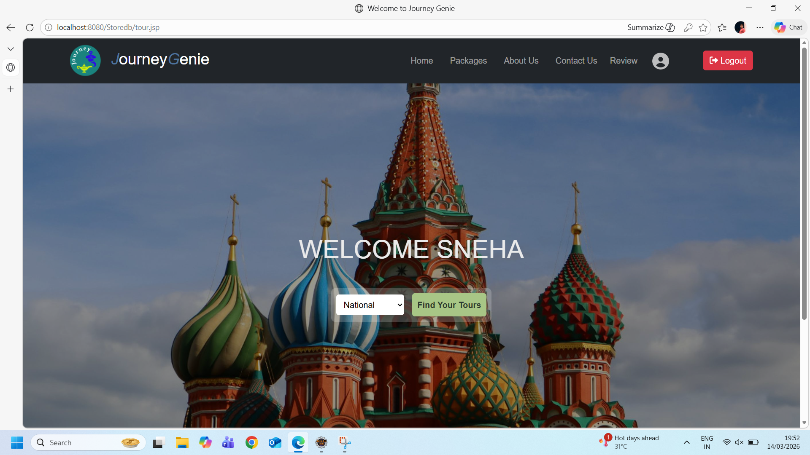

### Front Page
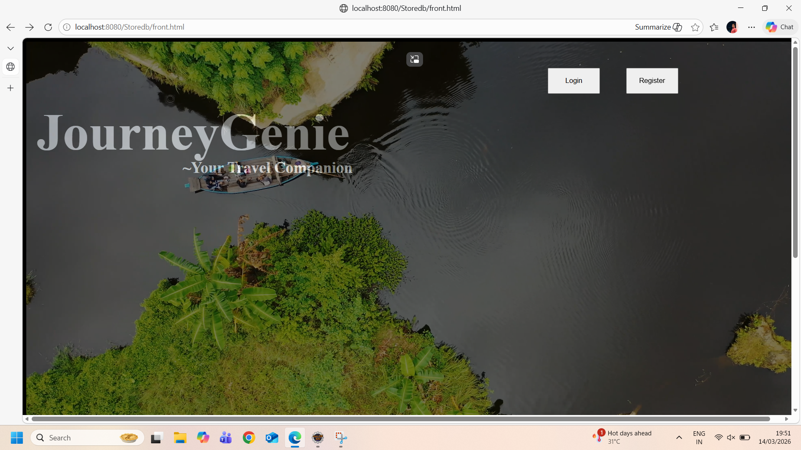

### Login Page
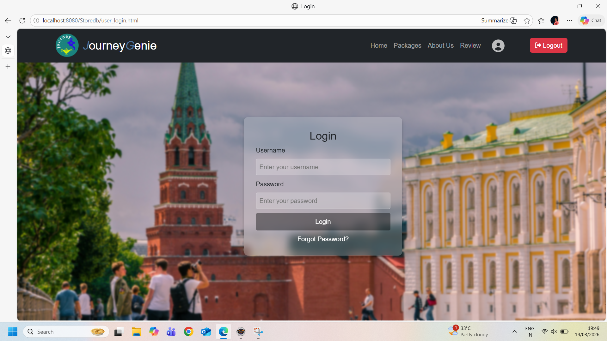

### About Us Page
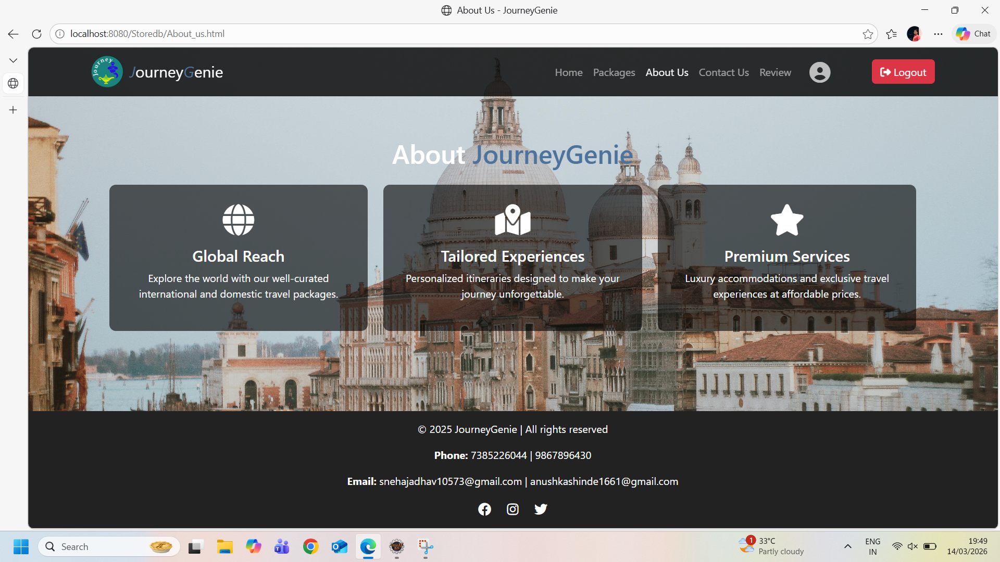

### National Tour Packages
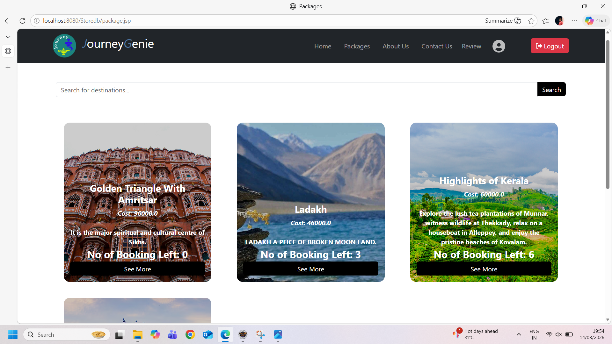

### Tour Packages
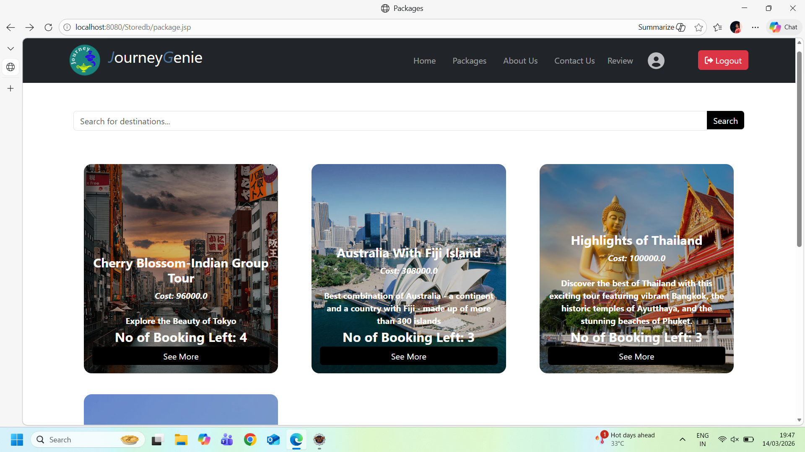

### Booking Page
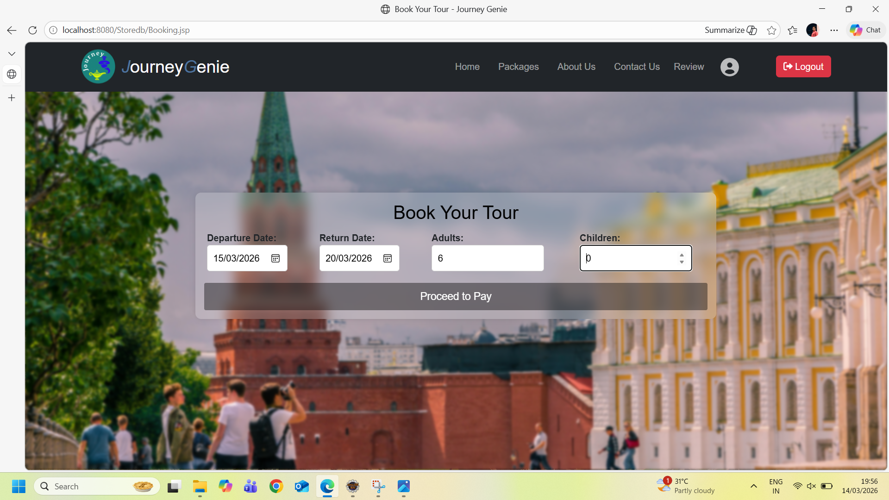

### User Dashboard
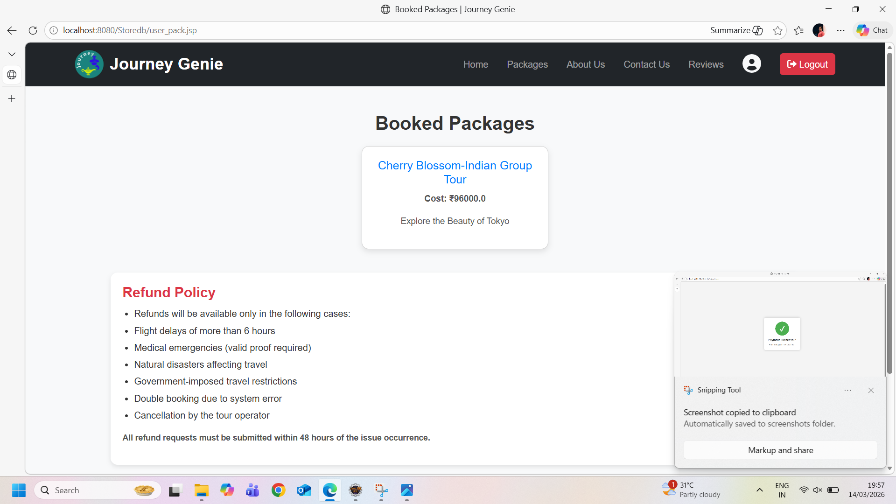

### Review Page
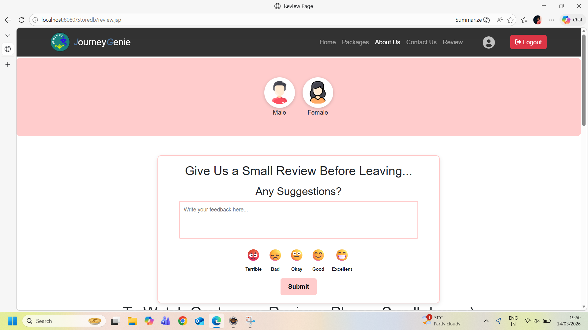

### Payment Selection
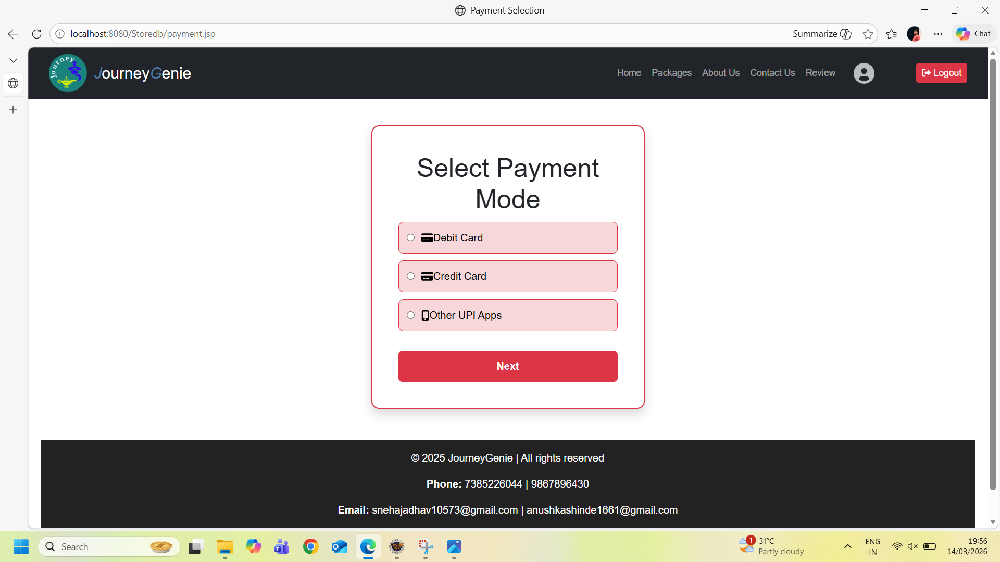

### Payment Successful
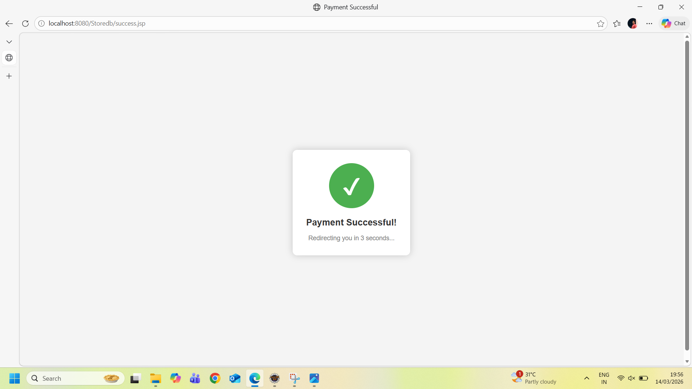

---

## 🚀 How to Run the Project

1. Clone the repository:
   ```bash
   git clone https://github.com/anu16-s/Travel-Management-System.git
   ```

2. Import the project into Eclipse.

3. Configure Apache Tomcat Server.

4. Create the MySQL database and import the required tables.

5. Update database credentials in the project.

6. Run the project on Tomcat Server.

7. Open in browser:
   ```
   http://localhost:8080/Storedb
   ```

## 👩‍💻 Author

**Anushka Shinde**

M.Sc. Computer Science Student

GitHub: https://github.com/anu16-s


